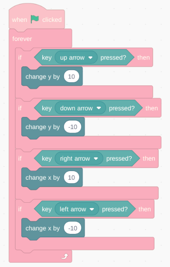

# Example 1 - Cat

The simplest type of game on Ivy is the pure web game. These types of games do not implement any integration with Ivy's platform - they are simply playable from the game page. If you're still learning how the Ivy platform works, this is what you'll want to start with.

In this example, we'll create a game using the Scratch block-based game platform, then upload it to Ivy.

To complete this example, you'll need:

- A desktop computer, to comfortably create and edit your Scratch project.
- A web3-enabled Solana wallet such as [Phantom](https://phantom.com/download), [Backpack](https://backpack.app/download), or [Solflare](https://www.solflare.com/download/).
- At least $5 worth of SOL in your wallet, to cover Solana network fees. (Ivy does not charge any fees for uploading games).

## 1. Sign up for Scratch

First, visit [the Scratch website](https://scratch.mit.edu) and create a new account. Verify a non-temporary email address; this is necessary to ensure that sharing your project will work.

## 2. Create a New Project

On the Scratch homepage, click "Create" on the top navigation bar. This will redirect you to the Scratch editor. You'll see the output window, which contains a single sprite, the Scratch cat.

## 3. Implement Directional Movement

Using the blocks in "Events", "Control", and "Sensing", and "Motion", create the following arrangement of blocks in the work area:

Press the green flag in the output window, and try using the arrow keys to move the Scratch cat around the screen.

## 4. Sharing your Game on Scratch

Let's make our game public on Scratch, the first step towards publishing it on Ivy. To do this, we'll want to click the orange "Share" button on the top of the project editor:

Once you've shared your project, you'll see a screen with a green confirmation message, like this:

You'll want to copy the URL at the top of your browser - you'll need it. In this case, it's `https://scratch.mit.edu/projects/1162088839/`.

## 5. Publishing your Game on Ivy

To publish your game on Ivy, visit the Ivy homepage and click the "Upload Game" button in the top right. Input your preference for the game's name, symbol, description, and icons. We'll leave "Initial Purchase" blank for now.

For the game URL, we'll take the URL from earlier and add `embed` to the end of it, like this:

The full form should look like this:

Press "Upload Game". You'll be redirected to the confirmation dialog:

Click "Connect Wallet", and connect your Solana wallet, then press "Submit Transaction". If all goes well, you should be redirected to the confirmation screen.

## 6. Congratulations!

Congratulations, you've just published your first game on Ivy! You're free to make any additional changes to your Scratch project: they should reflect automatically in the final product.

