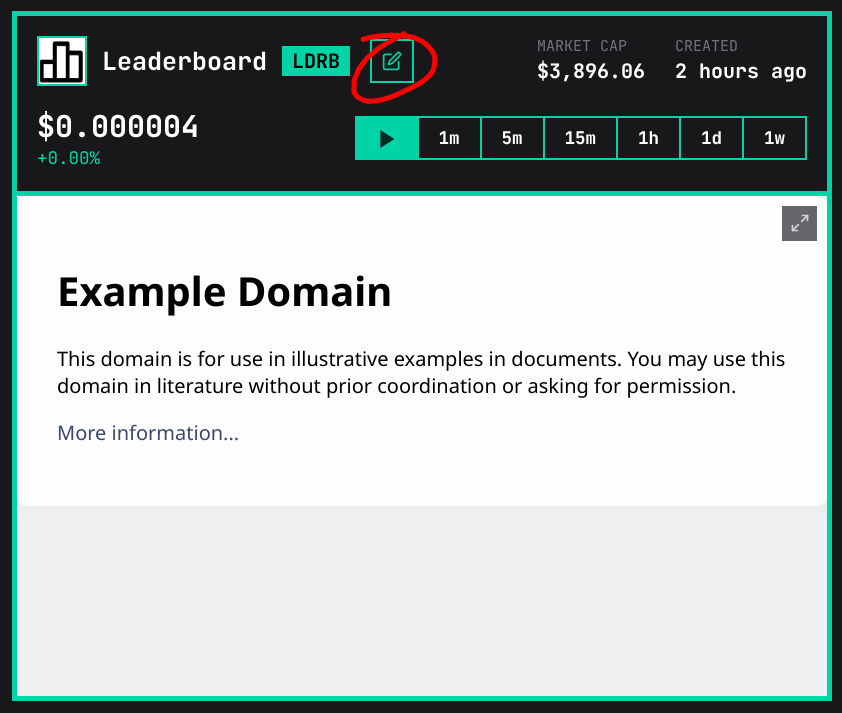
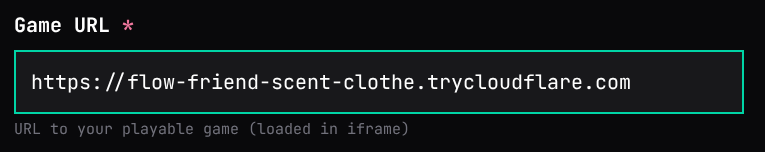
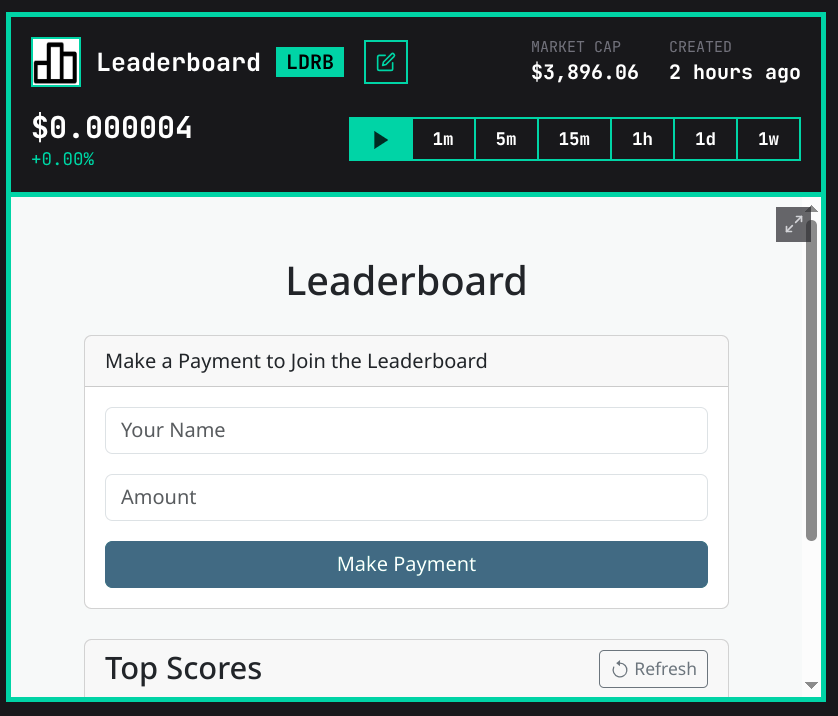

# Example 2 - Leaderboard

In this example, we'll demonstrate Ivy's deposit functionality by creating a user leaderboard. Users will be ranked based on how much of the game's token they've deposited to your game's treasury.

To complete this example, you'll need:

- A desktop computer with [Node.js](https://nodejs.org/en/download) installed.
- A web3-enabled Solana wallet such as [Phantom](https://phantom.com/download), [Backpack](https://backpack.app/download), or [Solflare](https://www.solflare.com/download/).
- At least ~$2 worth of SOL in your wallet, to cover Solana network fees. (Ivy does not charge any fees for uploading games).

## 1. Create our Project

Let's create a new Node.js project! Create a new directory on your computer and enter it; you can name it whatever you like, but we'll use `ivy-leaderboard` for this tutorial:

```sh
mkdir ivy-leaderboard
cd ivy-leaderboard
```

Now, let's create our Node.js project:

```sh
npm init -y
```

We'll need to install the Express web server as a dependency:

```sh
npm install express
```

## 2. The Server Code

Let's prepare the server code. The leaderboard server will serve the leaderboard to incoming users. It will also hook into Ivy's API to allow users to deposit funds to increase their score on the leaderboard. Open a new file, `index.js`, and insert the following:

```js
const express = require("express");
const fs = require("fs");
const app = express();

// Constants (update this in your own app)
const GAME_ADDRESS = "your-game-address";
const IVY_URL = "https://ivypowered.com";
const PORT = 9000;

// Setup
app.set("view engine", "ejs");
app.use(express.urlencoded({ extended: true }));

// Read leaderboard from the leaderboard file
// { name: string, score: number }[]
function getLeaderboard() {
    try {
        const data = fs.readFileSync("leaderboard.json", "utf8");
        return JSON.parse(data);
    } catch (error) {
        return [];
    }
}

// Save `leaderboard` to the leaderboard file
function saveLeaderboard(leaderboard) {
    fs.writeFileSync("leaderboard.json", JSON.stringify(leaderboard, null, 4));
}

// Show leaderboard
app.get("/", (req, res) => {
    const leaderboard = getLeaderboard();

    // Render HTML page
    res.render("index", { leaderboard });
});

// Call Ivy API to generate hex ID
async function generateId(amount) {
    const amountRaw = Math.ceil(amount * 1_000_000_000);
    const response = await fetch(`${IVY_URL}/api/id?amountRaw=${amountRaw}`);
    const result = await response.json();
    if (result.status !== "ok") {
        throw new Error(result.msg);
    }
    return result.data;
}

// Read deposits from the deposits file
// id (string) -> deposit ({ amount: string, completed: boolean })
function getDeposits() {
    try {
        const data = fs.readFileSync("deposits.json", "utf8");
        return JSON.parse(data);
    } catch (error) {
        return {};
    }
}

// Save `deposits` to the deposits file
function saveDeposits(deposits) {
    fs.writeFileSync("deposits.json", JSON.stringify(deposits, null, 4));
}

// Begin payment
app.post("/payment-begin", async (req, res) => {
    // Get name + amount
    const { name, amount: amountString } = req.body;
    const amount = parseFloat(amountString);
    if (!name || isNaN(amount) || amount <= 0) {
        return res.status(400).send("Invalid name or amount");
    }

    // Generate ID
    const id = await generateId(amount);

    // Store deposit
    const deposits = getDeposits();
    deposits[id] = {
        name,
        amount,
        completed: false,
    };
    saveDeposits(deposits);

    // Where the user will go after the successful payment
    const redirect = encodeURIComponent(
        `${req.protocol}${req.host}/payment-finish?id=${id}`,
    );
    res.redirect(
        `${IVY_URL}/deposit?game=${GAME_ADDRESS}&id=${id}&redirect=${redirect}`,
    );
});

// Call Ivy API to see whether deposit has been completed
async function isDepositComplete(id) {
    const response = await fetch(
        `${IVY_URL}/api/games/${GAME_ADDRESS}/deposits/${id}`,
    );
    const result = await response.json();
    if (result.status !== "ok") {
        throw new Error(result.msg);
    }
    if (!result.data) {
        return false;
    }
    return typeof result.data.signature === "string";
}

// Finish a payment
app.get("/payment-finish", async (req, res) => {
    const { id } = req.query;
    if (!id) {
        res.status(400).send("Invalid ID");
        return;
    }

    const deposits = getDeposits();
    const deposit = deposits[id];
    if (!deposit) {
        res.status(400).send("Deposit not found");
        return;
    }

    const isComplete = await isDepositComplete(id);
    if (isComplete && !deposit.completed) {
        // Retrieve leaderboard
        const leaderboard = getLeaderboard();

        // Insert or increment leaderboard entry for player
        const entry = leaderboard.find((e) => e.name === deposit.name);
        if (entry) {
            entry.score += deposit.amount;
        } else {
            leaderboard.push({
                name: deposit.name,
                score: deposit.amount,
            });
        }

        // Sort leaderboard in descending order
        leaderboard.sort((a, b) => b.score - a.score);

        // Save leaderboard
        saveLeaderboard(leaderboard);

        // Mark deposit as complete
        deposit.completed = true;

        // Save deposits
        saveDeposits(deposits);
    }

    res.render("payment-finish", {
        id,
        name: deposit.name,
        amount: deposit.amount,
        isComplete,
    });
});

app.listen(PORT, () => {
    console.log(`Leaderboard running on http://127.0.0.1:${PORT}`);
});
```

## 3. The Main Page

Let's create the main page, which will display the current leaderboard, and also provide a form to allow the user to submit data. Create a new directory called `views` right next to `index.js`. Create a new file, `views/index.ejs`, and insert the following:

```html
<!DOCTYPE html>
<html>
    <head>
        <title>Leaderboard</title>
        <link
            href="https://cdn.jsdelivr.net/npm/bootstrap@5.3.0/dist/css/bootstrap.min.css"
            rel="stylesheet"
        />
    </head>
    <body class="bg-light">
        <div class="container mt-5">
            <h1 class="text-center mb-4">Leaderboard</h1>

            <!-- Payment Form -->
            <div class="card mx-auto mb-4" style="max-width: 600px;">
                <div class="card-header">
                    Make a Payment to Join the Leaderboard
                </div>
                <form
                    action="/payment-begin"
                    target="_blank"
                    method="POST"
                    class="card-body"
                >
                    <input
                        type="text"
                        class="form-control mb-3"
                        name="name"
                        placeholder="Your Name"
                        required
                    />
                    <input
                        type="number"
                        class="form-control mb-3"
                        name="amount"
                        placeholder="Amount"
                        min="0.01"
                        step="0.01"
                        required
                    />
                    <button type="submit" class="btn btn-primary w-100">
                        Make Payment
                    </button>
                </form>
            </div>

            <!-- Leaderboard -->
            <div class="card mx-auto" style="max-width: 600px;">
                <div
                    class="card-header d-flex justify-content-between align-items-center"
                >
                    <h3 class="mb-0">Top Scores</h3>
                    <button
                        type="button"
                        class="btn btn-outline-secondary btn-sm"
                        onclick="location.reload()"
                    >
                        <svg
                            width="16"
                            height="16"
                            fill="currentColor"
                            class="bi bi-arrow-clockwise"
                            viewBox="0 0 16 16"
                        >
                            <path
                                fill-rule="evenodd"
                                d="M8 3a5 5 0 1 1-4.546 2.914.5.5 0 0 0-.908-.417A6 6 0 1 0 8 2v1z"
                            />
                            <path
                                d="M8 4.466V.534a.25.25 0 0 0-.41-.192L5.23 2.308a.25.25 0 0 0 0 .384l2.36 1.966A.25.25 0 0 0 8 4.466z"
                            />
                        </svg>
                        Refresh
                    </button>
                </div>
                <div class="card-body p-0">
                    <% if (leaderboard.length > 0) { %>
                    <table class="table table-striped mb-0">
                        <thead class="table-dark">
                            <tr>
                                <th>Rank</th>
                                <th>Player</th>
                                <th>Score</th>
                            </tr>
                        </thead>
                        <tbody>
                            <% leaderboard.forEach((player, index) => { %>
                            <tr>
                                <td>
                                    <% if (index === 0) { %>🥇 <% } else if
                                    (index === 1) { %>🥈 <% } else if (index ===
                                    2) { %>🥉 <% } else { %>#<%= index + 1 %> <%
                                    } %>
                                </td>
                                <td><strong><%= player.name %></strong></td>
                                <td><%= player.score.toLocaleString() %></td>
                            </tr>
                            <% }); %>
                        </tbody>
                    </table>
                    <% } else { %>
                    <p class="text-center p-4 text-muted">
                        No scores yet! Be the first to play!
                    </p>
                    <% } %>
                </div>
            </div>
        </div>
    </body>
</html>
```

## 4. The Payment Page

Let's create the payment page. It will provide a waiting area while we're waiting for a payment to go through, and a success page when the payment is complete.

```html
<!DOCTYPE html>
<html>
    <head>
        <title>Payment Status</title>
        <link
            href="https://cdn.jsdelivr.net/npm/bootstrap@5.3.0/dist/css/bootstrap.min.css"
            rel="stylesheet"
        />
        <% if (!isComplete) { %>
        <meta http-equiv="refresh" content="5" />
        <% } %>
    </head>
    <body class="bg-light">
        <div class="container mt-5">
            <div class="card mx-auto" style="max-width: 600px;">
                <% if (isComplete) { %>
                <!-- Payment Complete -->
                <div class="card-header bg-success text-white">
                    <h3 class="mb-0">🎉 Payment Complete!</h3>
                </div>
                <div class="card-body text-center">
                    <div class="mb-4">
                        <h4 class="text-success mb-3">
                            Congratulations, <%= name %>!
                        </h4>
                        <p class="lead">
                            Your payment of
                            <strong><%= parseFloat(amount) %></strong> has been
                            successfully processed.
                        </p>
                        <p class="text-muted">
                            You've been added to the leaderboard!
                        </p>
                    </div>

                    <div class="d-grid gap-2">
                        <button
                            onclick="window.close()"
                            class="btn btn-outline-secondary"
                        >
                            Close Window
                        </button>
                    </div>
                </div>
                <% } else { %>
                <!-- Payment Pending -->
                <div class="card-header bg-warning text-dark">
                    <h3 class="mb-0">⏳ Payment Pending</h3>
                </div>
                <div class="card-body text-center">
                    <div class="mb-4">
                        <h4 class="text-warning mb-3">Processing Payment...</h4>
                        <p class="lead">
                            Hi <%= name %>, your payment of
                            <strong><%= parseFloat(amount) %></strong> is being
                            processed.
                        </p>
                        <p class="text-muted">
                            This page will automatically refresh every 5 seconds
                            to check the status.
                        </p>
                    </div>

                    <div class="mb-4">
                        <div class="spinner-border text-warning" role="status">
                            <span class="visually-hidden">Loading...</span>
                        </div>
                    </div>

                    <div class="d-grid gap-2">
                        <button
                            onclick="window.location.reload()"
                            class="btn btn-warning"
                        >
                            🔄 Refresh Now
                        </button>
                        <a href="/" class="btn btn-outline-secondary">
                            🏠 Return to Main Page
                        </a>
                    </div>

                    <small class="text-muted d-block mt-3">
                        Payment ID: <%= id %>
                    </small>
                </div>
                <% } %>
            </div>
        </div>
    </body>
</html>
```

## 5. Creating our Game on Ivy

To use Ivy payment integration in our leaderboard, first we'll need our game address. So, let's create our game on Ivy. Go to the Ivy homepage and press "Upload Game", then follow the prompts to create a new game. Fill in all the other fields how you like them, but set the game URL to `https://example.com`; we won't put our URL in yet.

When you click "Go to Dashboard" at the end, you'll be redirected to a URL that will look like `https://ivypowered.com/game?address=85ypuUj1hzTrKKzEA9CfYyLAxk2mdHVvr3dqApqew63n`.

Take that last part, and modify the `GAME_ADDRESS` constant in the beginning of `index.js` accordingly, like so:

```js
const GAME_ADDRESS = "85ypuUj1hzTrKKzEA9CfYyLAxk2mdHVvr3dqApqew63n";
```

## 6. Running the Leaderboard

Our code is finished! Let's run our project. Open your console to the project directory, and type:

```js
node index.js
```

If all goes well, your leaderboard should be accessible and functional on `http://127.0.0.1:9000`! To test it, buy some of your token on its Ivy page, and deposit some on your leaderboard's page. You should see your changes reflected on the homepage, as well as the `leaderboard.json` and `deposits.json` data files in your project directory. (Try changing `leaderboard.json`, and seeing it update on the site when you refresh!)

## 7. Make it Globally Accessible

Now that our leaderboard works locally, let's make it globally accessible on Ivy. To do this, we can use Cloudflare Tunnel, which we can install like this:

```sh
npm install cloudflared -g
```

Now, run:

```sh
cloudflared tunnel --url http://127.0.0.1:9000
```

You should get output like this:

```txt
2025-06-12T09:19:07Z INF Requesting new quick Tunnel on trycloudflare.com...
2025-06-12T09:19:11Z INF +--------------------------------------------------------------------------------------------+
2025-06-12T09:19:11Z INF |  Your quick Tunnel has been created! Visit it at (it may take some time to be reachable):  |
2025-06-12T09:19:11Z INF |  https://flow-friend-scent-clothe.trycloudflare.com                                        |
2025-06-12T09:19:11Z INF +--------------------------------------------------------------------------------------------+
```

Visit the URL provided in your browser and make sure it works! Then, go over to your page on Ivy for the game, log in to the wallet that you used to create the game, then press the edit button on the game header:



Modify the game URL to your Cloudflare Tunnel link, like so:



Hit "Save Changes", and submit the transaction. You should see your leaderboard appear on the game page!



## 8. Next Steps

Congratulations, you've successfully created a leaderboard on Ivy! Your leaderboard will remain online so long as your computer is on, and the Cloudflare Tunnel does not expire. If you want 24/7 availability, consider purchasing a Virtual Private Server from any hosting provider, and following the typical process to host a web service.
