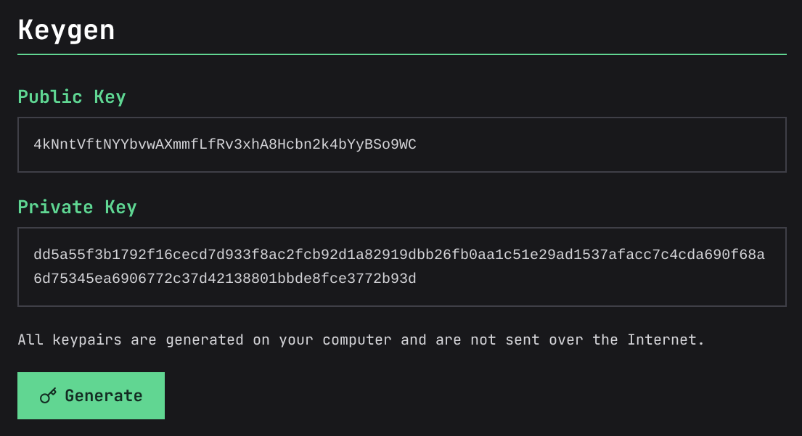

# Example 3 - Faucet

In this example, we'll demonstrate Ivy's withdraw functionality by creating a faucet game. In this game, users will complete a CAPTCHA to receive a small amount of the game token from the game's treasury.

To complete this example, you'll need:

- A desktop computer with [Node.js](https://nodejs.org/en/download) installed.
- A web3-enabled Solana wallet such as [Phantom](https://phantom.com/download), [Backpack](https://backpack.app/download), or [Solflare](https://www.solflare.com/download/).
- At least $5 worth of SOL in your wallet, to cover Solana network fees.

## 1. Create an hCaptcha account

For our CAPTCHA service, we'll use hCaptcha. Go to [the hCaptcha website](https://www.hcaptcha.com/) and sign up for an account. Once you've completed the signup, you should reach a Welcome dashboard. Click "Generate" to create your secret key:


Next, we need the HCaptcha site key. Click "Docs" on the top right.


On the right hand side, select "Add the hCaptcha Widget to your Webpage".


You'll be brought to a section containing the site key in an infobox.


We now have our secret key, `ES_f929c5c1bea373bb76f3c0dffc2725bb`, and our sitekey, `47bcc99a-8e98-472e-b11e-e0da2c44aa71`, which will of course differ when you perform the steps in this example.

## 2. Initialize our Project

Let's initialize our Node.js project. Create a new directory, such as `ivy-faucet`. Enter it via the command line, and type `npm init -y`. We'll also install three dependencies: run `npm install express hcaptcha ivy-sdk`. We're using the `hcaptcha` package for CAPTCHA verification, `ivy-sdk` for signing withdrawals, and the `express` package as our web server.

## 3. The Server Code

Create a file in your directory named `index.js` with the following code:

```js
const express = require("express");
const hcaptcha = require("hcaptcha");
const { Game, Id } = require("ivy-sdk");
const { PublicKey } = require("@solana/web3.js");
const app = express();

// Constants (update these in your own app)
const HC_SITEKEY = "(Your hCaptcha site key)";
const HC_SECRET = "(Your hCaptcha secret)";
const GAME_ADDRESS = new PublicKey("(Your game address)");
const WITHDRAW_KEY = Buffer.from(
    "(Your withdraw authority private key)",
    "hex",
);
const FAUCET_AMOUNT = 0.1; // Amount of tokens to give per claim
const IVY_URL = "http://127.0.0.1:3000";
const PORT = 7000;

// Setup
app.use(express.urlencoded({ extended: true }));

// Serve the faucet page
app.get("/", (req, res) => {
    res.send(`
<!DOCTYPE html>
<html>
<head>
    <title>Token Faucet</title>
    <link href="https://cdn.jsdelivr.net/npm/bootstrap@5.3.0/dist/css/bootstrap.min.css" rel="stylesheet">
    <script src="https://js.hcaptcha.com/1/api.js" async defer></script>
</head>
<body class="bg-light">
    <div class="container mt-5">
        <div class="row justify-content-center">
            <div class="col-md-6">
                <div class="card">
                    <div class="card-header text-center">
                        <h2>🚿 Faucet</h2>
                        <p class="mb-0 text-muted">Get ${FAUCET_AMOUNT} free tokens every 24 hours</p>
                    </div>
                    <div class="card-body">
                        <form method="POST" action="/claim" target="_blank">
                            <div class="mb-3">
                                <label for="address" class="form-label">Solana Wallet Address</label>
                                <input type="text" class="form-control" id="address" name="address"
                                       placeholder="Enter your wallet address" required>
                            </div>
                            <div class="mb-3">
                                <div class="h-captcha" data-sitekey="${HC_SITEKEY}"></div>
                            </div>
                            <button type="submit" class="btn btn-primary w-100">Claim Tokens</button>
                        </form>
                    </div>
                </div>
            </div>
        </div>
    </div>
</body>
</html>`);
});

app.post("/claim", async (req, res) => {
    const { address, "h-captcha-response": captcha } = req.body;

    // Verify CAPTCHA
    if (!(await hcaptcha.verify(HC_SECRET, captcha)).success) {
        throw new Error("Invalid or missing CAPTCHA");
    }

    // Generate ID
    const user = new PublicKey(address);
    const id = Id.generate((FAUCET_AMOUNT * 1_000_000_000).toString());
    const signature = Game.withdrawSign(
        /* game_address */ GAME_ADDRESS,
        /* id */ id,
        /* user */ user,
        /* withdraw_authority_key */ WITHDRAW_KEY,
    );

    res.redirect(
        `${IVY_URL}/withdraw?game=${GAME_ADDRESS}&id=${Buffer.from(id).toString("hex")}&signature=${Buffer.from(signature).toString("hex")}&user=${user.toBase58()}`,
    );
});

app.listen(PORT, () => {
    console.log(`Faucet running on http://127.0.0.1:${PORT}`);
});
```

## 4. Creating our Game on Ivy

To populate the constants at the beginning of `index.js`, we'll need our hCaptcha sitekey and secret, which we have, as well as our game address and withdrawal authority key, which we don't have. So, let's go about creating that. Go to the Ivy homepage and press "Upload Game", then create a new game. We'll set our game URL to `https://example.com` for now, like so:


Once we finish, you'll be redirected to your game dashboard. On your browser, this should be a link like `https://ivypowered.com/game?address=F4sLzhfYfGyWRAkR29J8a1zJANWyjTu6bDYyTnAMJiS2`. Take your game address from this URL, and use it to populate the `GAME_ADDRESS` constant at the top of `index.js`, like so:

```js
const GAME_ADDRESS = new PublicKey(
    "F4sLzhfYfGyWRAkR29J8a1zJANWyjTu6bDYyTnAMJiS2",
);
```

Next, we want to create a withdraw authority. A withdraw authority is a Solana account that creates a cryptographic signature for each withdrawal. When users claim this withdrawal, they submit the cryptographic signature to the blockchain, it's verified, and the withdrawal is claimed.

First, we'll generate a withdrawal authority. Go to [the key generation tool](https://ivypowered.com/keygen) and press "Generate". You'll receive a public/private key pair:



We'll insert the private key into our `index.js`, like so:

```js
const WITHDRAW_KEY = new Buffer(
    `dd5a55f3b1792f16cecd7d933f8ac2fcb92d1a82919dbb26fb0aa1c51e29ad1537afacc7c4cda690f68a6d75345ea6906772c37d42138801bbde8fce3772b93d`,
    "hex",
);
```

For the public key, go back to your game's dashboard and click the "Edit" button:


Under "Access Management", input the public key under Withdraw Authority:


Hit "Save Changes", and submit the transaction to the blockchain.

## 5. Depositing Tokens to the Treasury

For users to claim tokens from our faucet, there have to be some tokens in the game treasury they can claim first! Go back to your game's dashboard and buy some tokens. Then, under "Treasury Management", deposit them to your game's treasury:


Now, your users have tokens to withdraw!

## 6. Local Testing

Excellent, everything is set up. Let's test our faucet locally by running `node index.js`. If all goes well, it should be accessible and functional at `http://127.0.0.1:7000`!

## 7. Make it Globally Accessible

Install and run Cloudflare Tunnel:

```sh
npm install cloudflared -g
cloudflared tunnel --url http://127.0.0.1:9000
```

Copy the generated URL. Then, edit your game's URL on Ivy to point to your tunnel. Your faucet is now live!

## 8. Next Steps

Congratulations, you've created a simple token faucet on Ivy! It will remain online so long as your computer is on, and the CF tunnel does not expire. For 24/7 availability, consider deploying to a VPS.
